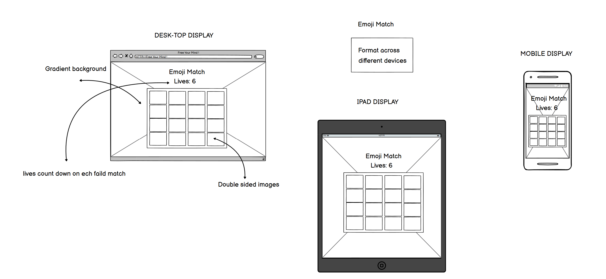
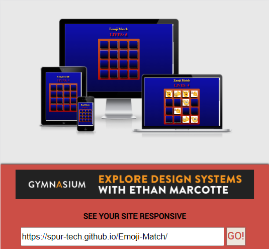
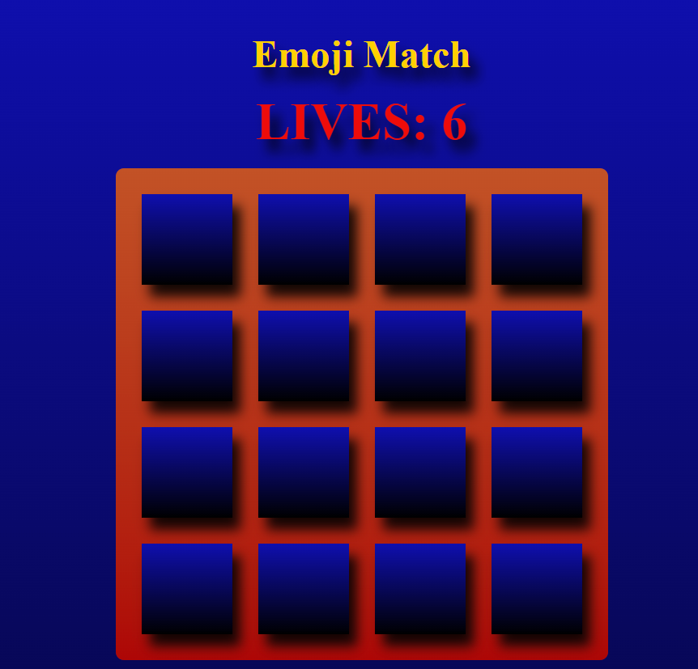
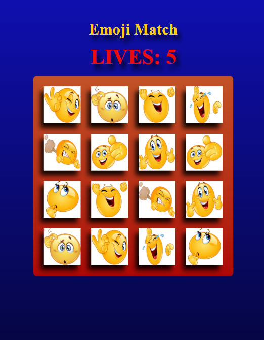
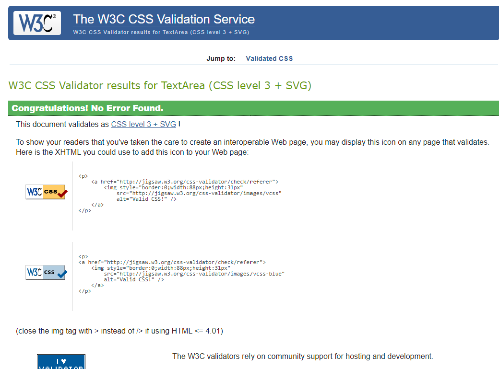
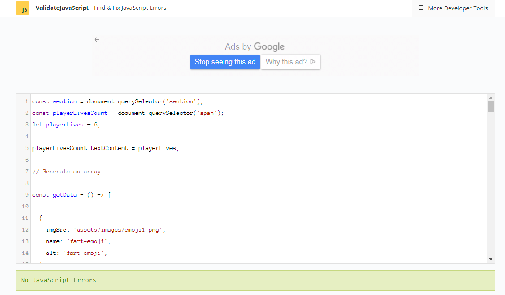
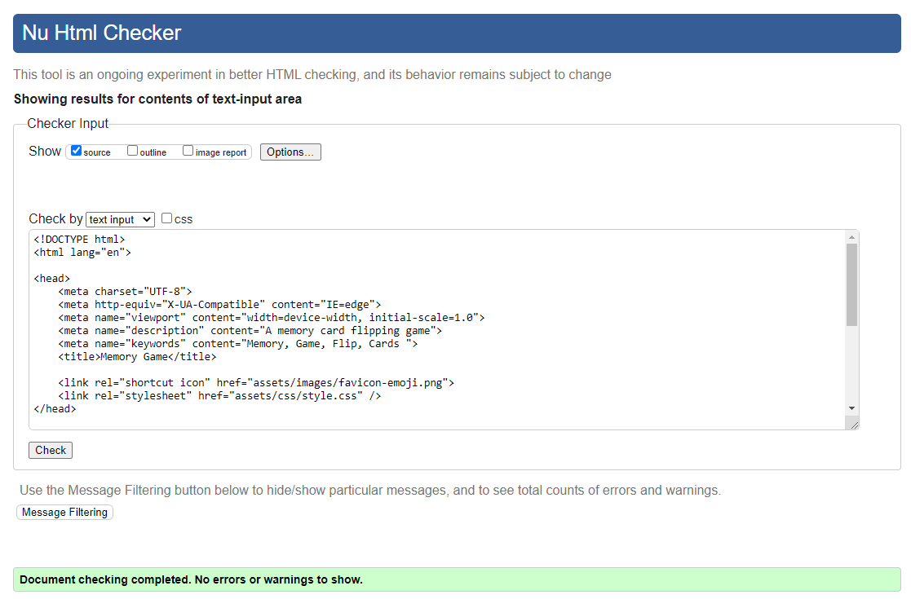
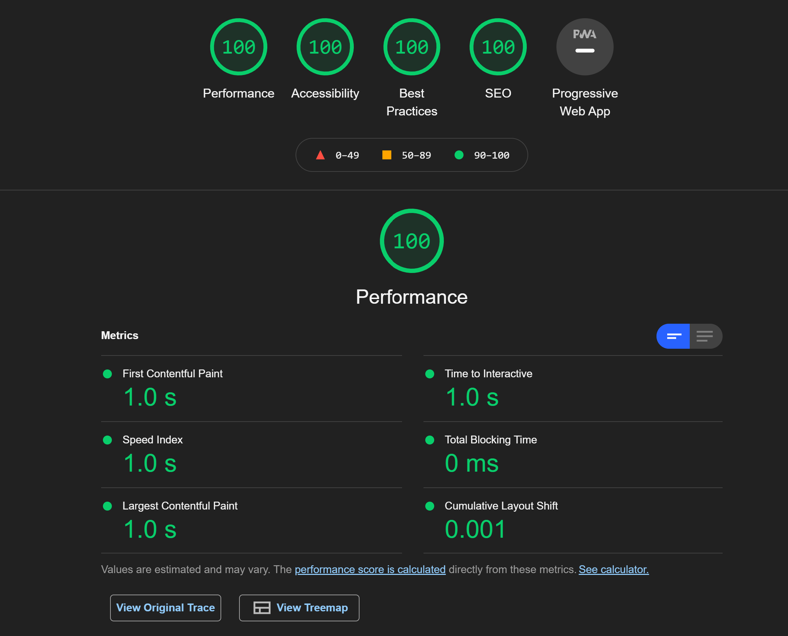
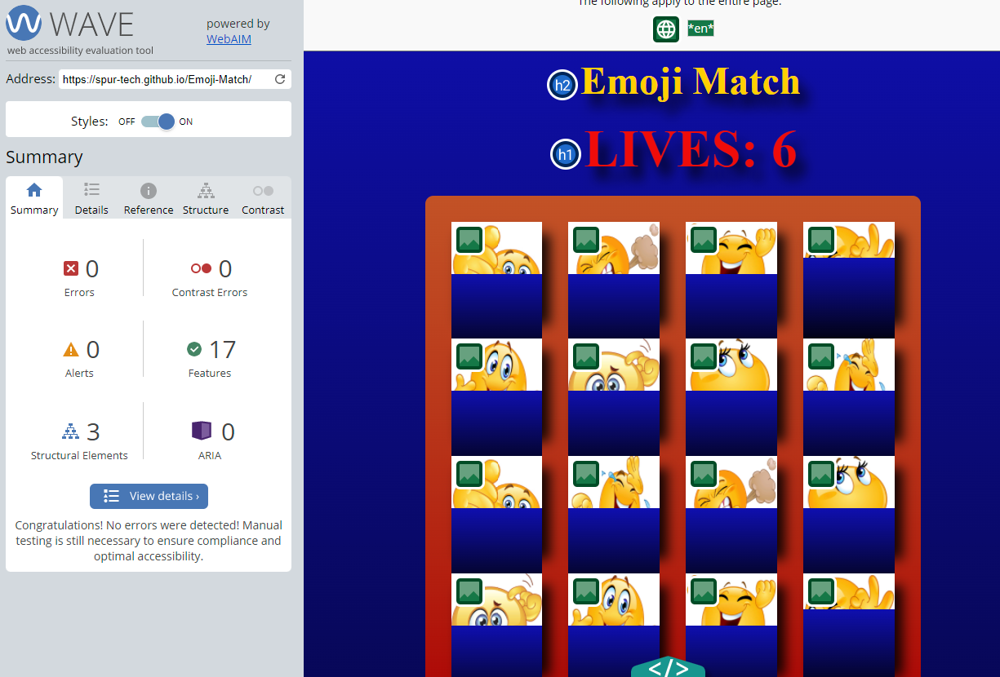

# Emoji Match
https://spur-tech.github.io/Emoji-Match/

## Details and construction of Emoji Match memory game:

This memory testing card flipping game was created purely for fun and to test my knowledge of Java script functions and for loops.

## project mission:
---

To make a simple memory game where you need to match two identical cards and keep going until you reveal all the cards but you only have 6 lives. I'ts more difficult than you may first think.

## User stories:
----

- As a first time user I would like to play a quick and easy game to pass the time.

- As a first time user I would like to play a game without needing to read instructions.

- As a returning user I want to reveal all the cards with more remaining lives than the last time eventually trying to complete the perfect 6 remaining.

## Wireframe:
---
This is the wireframe, The raw structure of the game.

-----

##  Screen shot of the site and it's responsive abilities:

I used http://ami.responsivedesign.is/ to check the responsive capabilities on all devices.
As you can see it's fully responsive right across all devices and adapts to any screen size.

# Organization:

All files are appropriately named with no capitalization or spaces and all in corresponding folders.

- Assets
- css
- style.css
- images
- js
- script.js
- index.html
- README.md

## features:
---

A favicon image was used in tab.

Background colours are blue gradient to black and card backs matching.
Game section background is orange to red gradient and lives matching the red.
The title matching the emoji yellow.

All free emoji images were used from https://pixabay.com/images/search/emojis/

# Testing:

- I tested each line of java script with a console.log before continuing.

 - Then tested responsive effects on my phone, Ipad, laptop and pc all worked efficiently.

 - My testing for my css was performed on https://jigsaw.w3.org/css-validator/validator.

 

 - I tested my javascript on https://validatejavascript.com/ 

 

 - I tested my html with https://validator.w3.org/

 

 - I tested my site on lighthouse with excellent results.

  - I tested accessibility with no errors or warnings https://wave.webaim.org/

# Bugs and Fixes:

- I had issues with compatibility across devices with css backface property so I added -webkit and -moz that seemed to work.

- I had issues with with calling images in javascript as they all doubled so I removed them from html that did the trick.

- I had issues with alt tags throwing errors in wave so I created alt tags in javascript as I removed img, src, alt in html. 

- I had issues with acknowledgement of pairs in javascript so I added names to images then matched names as pairs.

- I had issues with stop flipping cards as a pair is acknowledged so I turned off pointer events when pairs matched

- I had issues with stopping lives going passed -1 so I created reset function when lives = 0.

- I had issues with randomize on reset as names didn't match cards so I reset cards, names, and lives.

- I had issues with seeing image micro seconds before turn back so I set randomize after turn back.

 - Each step forward in javascript was a new issue and I had to just adjust accordingly.

 # Credits:

 I would like to thank the Slack team and especially Dave Horrock for taking the time to screen share with me to go through some things and get me back up and running.

 I would also like to thank stack overflow for bits of code which I,ve marked directly in the code.

 A thank you to Jack my mentor for taking an emergency call to check my project and helping decide what to do.

 And a thank you to Google and Youtube for general researching.
 
A thank you to Pixabay for the images.

And Balsamiq wireframes where the project started.

## A credit to the following:

https://validator.w3.org/

https://jigsaw.w3.org/css-validator/

https://validatejavascript.com/

https://wave.webaim.org/

https://www.youtube.com/

https://github.com/Code-Institute-Solutions/readme-template

https://balsamiq.com/?gclid=Cj0KCQiA-qGNBhD3ARIsAO_o7ylOuN35WvS_a9h5lct3MRm73f2QkWIiy-HHSgxwuLB5U5yQZlcm8kwaAp6IEALw_wcB

# Deployment:

This site was developed in Gitpod, committed and pushed to Github, and deployed on GitHub Pages.

## How to deploy this site:

- Log in to Github then go to the repository you would like to deploy.
- Click on Settings in the toolbar.
- Click on Pages.
- Click on the Branch in the dropdown menu, and select Main.
- Click on Save.
- Click on the URL to navigate to the live site.

 

